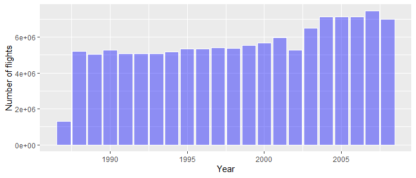
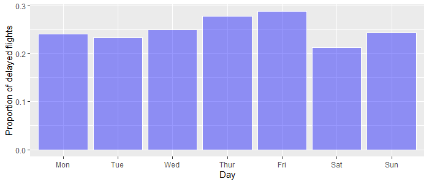

# Airline data analysis

Predicting delays from the airline dataset. After the exploratory data analysis, linear model was fitted to the data, in order to determine the factors that could cause flight delays. 

## Prerequisites 

* RSQLite
* sqldf
* tictoc
* biglm
* dummies
* gsub

## Data set

Data set provided at http://stat-computing.org/dataexpo/2009/ contains data about commercial flights in USA between 1987 and 2008. Data is described by

## Exploratory Data Analysis

  

